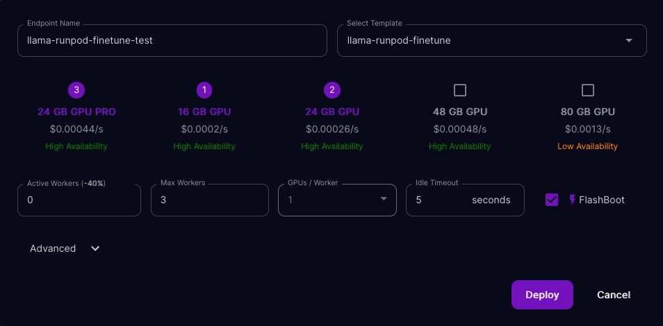

# Run llama.cpp on [RunPod](https://www.runpod.io/serverless-gpu)


## Description

RunPod provides a cheap serverless GPU service that allows to simply serve AI models. They handle queuing and auto-scaling.

You just have to provide a Docker image. This repository contains instructions to build your own image for any model.

## Steps

1. Clone this repository
2. Choose a model and download it to the `workspace` directory. Here we use [this model](https://huggingface.co/TheBloke/Llama-2-7B-GGUF/resolve/main/llama-2-7b.Q4_K_M.gguf) with 7B parameters.

```
wget -P workspace https://huggingface.co/TheBloke/Llama-2-7B-GGUF/resolve/main/llama-2-7b.Q4_K_M.gguf
```

3. Build the Docker image. Create a `llama-runpod-finetune` repository on [Docker Hub](https://hub.docker.com/) and replace `your-docker-hub-login` with your login.

```
docker build -t llama-runpod-finetune .
docker tag llama-runpod-finetune your-docker-hub-login/llama-runpod:latest
docker push your-docker-hub-login/llama-runpod-finetune:latest
```

4. Go to RunPod's serverless [console](https://www.runpod.io/console/serverless) and create a template:


You can pass the arguments to `llama_cpp` in the `LLAMA_ARGS` environment variable. Here are mine:

```
{"model": "llama-2-7b.Q4_K_M.gguf", "n_gpu_layers": -1}
```

`n_gpu_layers` is set to -1 to offload all layers to the GPU.

5. Create the endpoint:



6. Profit!


Replace `ENDPOINT_ID` and `API_KEY` with your own values. You can get `API_KEY` on [that page](https://www.runpod.io/console/serverless/user/settings).

TODO 